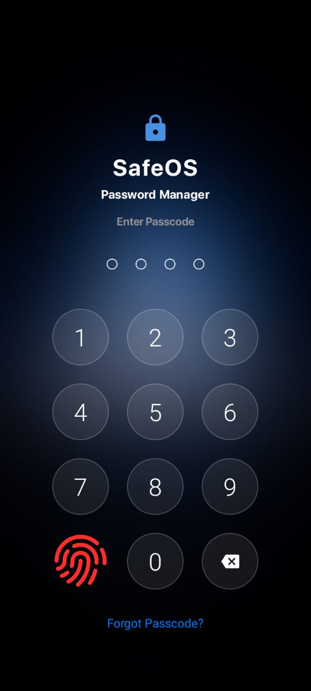
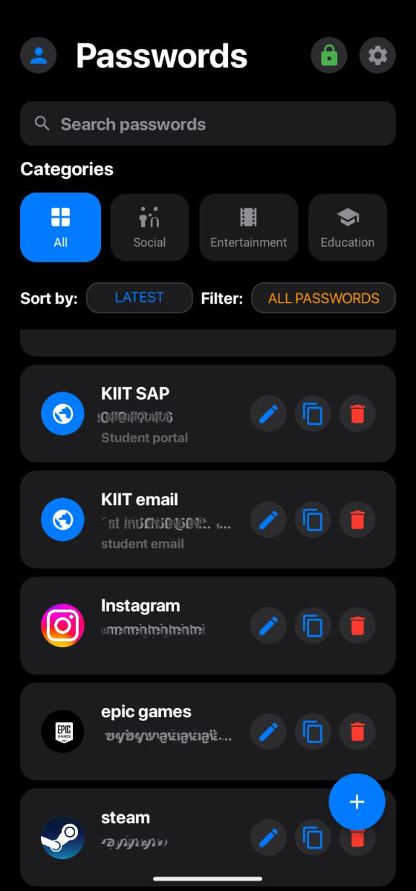
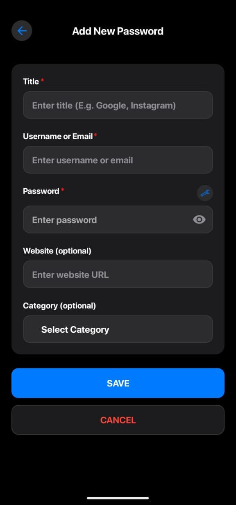
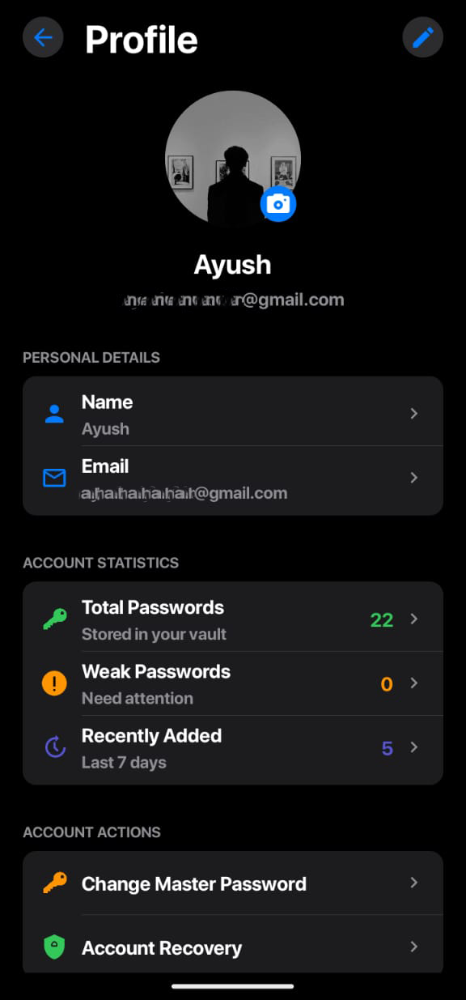
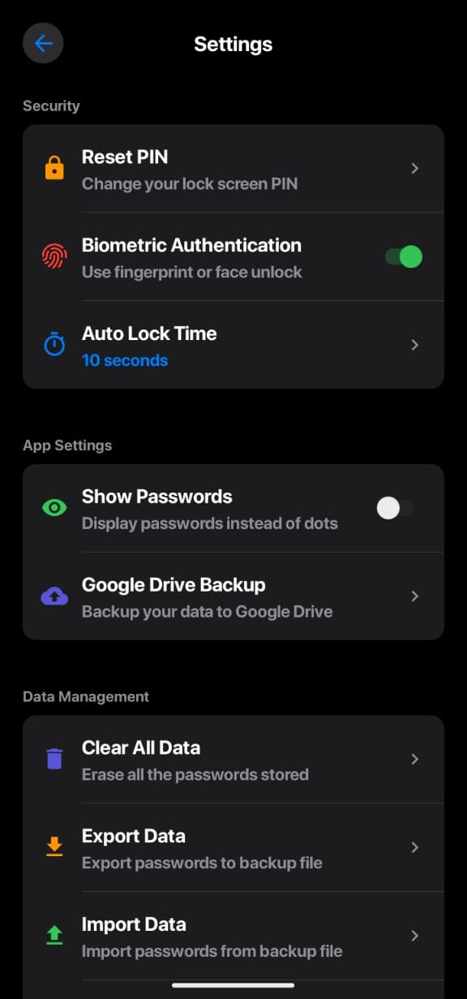
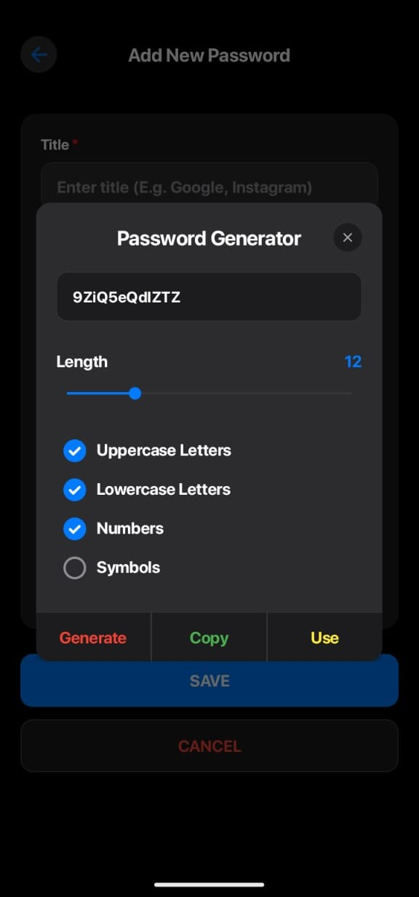

# SafeOS 🔐

<div align="center">
  <h3>🛡️ Secure • Simple • Reliable</h3>
  <p><strong>A modern, secure, and user-friendly password manager for Android with offline-first approach</strong></p>
</div>

---

## 📱 Overview

SafeOS is a comprehensive password management solution built for Android that prioritizes security, privacy, and user experience. With its sleek iOS-inspired dark interface and robust security features, SafeOS keeps your digital credentials safe without compromising on usability.

**Why SafeOS?**
- 🔒 **Zero Trust Architecture** - Your data never leaves your device unencrypted
- 🎨 **Beautiful Interface** - iOS-inspired design with Material 3 components
- 🚀 **Performance First** - Optimized for speed and battery efficiency
- 🛡️ **Enterprise Security** - AES-256 encryption with biometric authentication

---

## ⚠️ Why SafeOS Is NOT Open Source

SafeOS Password Manager is **not open source**, and this is a deliberate decision for your security:

> **The encryption key used to protect user data is present in the app’s source code. If published openly, this would compromise the safety of every user's sensitive information, making the strongest encryption worthless.**

Open source is great for collaboration and transparency, but for security-critical apps like SafeOS, the risk of exposing cryptographic secrets is too high.  
**As the sole developer of SafeOS, I am committed to keeping your data secure, and that means keeping this project closed source.**  
All development, updates, and maintenance are handled by me alone.

---

## ✨ Features

### 🔐 Security & Authentication
- **Biometric Authentication** - Fingerprint and Face ID support
- **PIN Protection** - Custom 4-digit PIN with secure lock screen
- **AES-256 Encryption** - Military-grade encryption for all data
- **Auto-lock Timer** - Configurable timeout (30s to 30min)
- **Secure PIN Pad** - Custom iOS-style numpad with haptic feedback

### 💾 Backup & Data Management
- **Google Drive Backup** - Encrypted cloud synchronization
- **Import/Export** - Secure data transfer with end-to-end encryption
- **Data Recovery** - Account recovery options with security questions
- **Bulk Operations** - Import from other password managers
- **Clear Data** - Secure data wiping with confirmation

### 🎯 Password Management
- **Advanced Password Generator** - Customizable length and character sets
- **Weakness Detection** - Identify and highlight weak passwords
- **Smart Categories** - Auto-categorization with custom icons
- **Duplicate Detection** - Find and merge duplicate entries
- **Search & Filter** - Lightning-fast password lookup

### 📊 Analytics & Insights
- **Security Dashboard** - Overview of password strength
- **Usage Statistics** - Track recently added and accessed passwords
- **Security Alerts** - Notifications for weak or reused passwords
- **Account Health** - Visual indicators for password security

### 🎨 User Experience
- **Dark Theme** - Elegant dark interface with custom animations
- **iOS-inspired Design** - Familiar UI patterns with Android optimizations
- **Haptic Feedback** - Tactile responses for better user interaction
- **Accessibility** - Full support for screen readers and accessibility features
- **Customizable Settings** - Personalize your experience

---

## 🛠️ Technology Stack

| Component | Technology |
|-----------|------------|
| **Language** | Java & Kotlin |
| **UI Framework** | Material Design 3 + Custom Components |
| **Database** | SQLite with Room Persistence Library |
| **Architecture** | MVVM (Model-View-ViewModel) |
| **Encryption** | AES-256-GCM encryption |
| **Biometrics** | Android BiometricPrompt API |
| **Cloud Storage** | Google Drive API v3 |
| **Image Loading** | Glide |
| **Animations** | Lottie & Custom View Animations |

---

## 📦 Installation

### Prerequisites
- Android Studio Arctic Fox or later
- Android SDK 24+ (Android 7.0)
- Google Play Services (for Google Drive backup)


## 📱 Screenshots

<div align="center">
  
| Lock Screen | Main Dashboard | Add Password |
|-------------|---------------|--------------|
|  |  |  |

| Profile | Settings | Password Generator |
|---------|----------|-------------------|
|  |  |  |
  
</div>

---

## 🏗️ Project Structure

```
SafeOS/
├── app/
│   ├── src/main/
│   │   ├── java/com/safeos/
│   │   │   ├── activities/          # Activity classes
│   │   │   ├── adapters/           # RecyclerView adapters
│   │   │   ├── database/           # Room database components
│   │   │   ├── fragments/          # Fragment classes
│   │   │   ├── models/             # Data models
│   │   │   ├── services/           # Background services
│   │   │   ├── utils/              # Utility classes
│   │   │   └── viewmodels/         # ViewModel classes
│   │   ├── res/
│   │   │   ├── drawable/           # Vector drawables & shapes
│   │   │   ├── font/               # Custom fonts
│   │   │   ├── layout/             # XML layouts
│   │   │   ├── values/             # Colors, strings, styles
│   │   │   └── xml/                # Preferences & configurations
│   │   └── AndroidManifest.xml
│   ├── build.gradle
│   └── proguard-rules.pro
├── gradle/
├── screenshots/                    # App screenshots
├── docs/                          # Documentation
├── LICENSE
└── README.md
```

---

## 🔒 Security Features

### Encryption Implementation
- **AES-256-GCM** encryption for all stored passwords
- **PBKDF2** key derivation with 100,000 iterations
- **Salt-based** encryption with unique salts per entry
- **Secure random** IV generation for each encryption

### Authentication Flow
1. **First Launch**: Set up master PIN and biometric authentication
2. **Subsequent Access**: Biometric or PIN verification
3. **Auto-lock**: Automatic locking after configured timeout
4. **Failed Attempts**: Progressive delays with account lockout

### Data Protection
- **Memory Protection**: Sensitive data cleared from memory after use
- **Screen Recording Prevention**: Secure flag prevents screenshots
- **Background Protection**: App content hidden in recent apps
- **Root Detection**: Warning for rooted devices

---

## 🚀 Performance Optimizations

- **Lazy Loading**: Password entries loaded on-demand
- **Database Indexing**: Optimized queries for fast search
- **Image Caching**: Website favicons cached locally
- **Background Processing**: Heavy operations on background threads
- **Memory Management**: Efficient memory usage with proper lifecycle handling

---

## 🤝 Contributing

**Note:**  
SafeOS is currently not accepting code contributions due to its closed source nature for security reasons.  
Suggestions, bug reports, and feature requests are always welcome!

### Areas for Feedback
- 🐛 Bug reports and improvements
- ✨ New feature suggestions
- 🌐 Internationalization ideas
- 📖 Documentation feedback

---


## 🐛 Known Issues

- Google Drive backup may fail on devices with restricted background activity
- Biometric authentication requires Android 6.0+ with enrolled biometrics
- Some custom Android ROMs may experience compatibility issues


```

## 🆘 Support & Help

### Getting Help
- 🐛 **Bug Reports**: ayusharyan.online@gmail.com
- 💡 **Feature Requests**: ayusharyan.online@gmail.com
- 💬 **Discussions**: ayusharyan.online@gmail.com

### FAQ

**Q: Is SafeOS compatible with other password managers?**  
A: Yes, SafeOS supports importing from most major password managers through CSV export/import.

**Q: What happens if I forget my master PIN?**  
A: You can use the account recovery feature, but this will require re-setting up your vault.

**Q: Can I use SafeOS without Google Drive?**  
A: Absolutely! SafeOS works completely offline. Google Drive is optional for backup only.

**Q: Is my data encrypted during Google Drive backup?**  
A: Yes, all data is encrypted locally before being uploaded to Google Drive.

---

## 🌟 Show Your Support

If SafeOS has been helpful to you, please consider:

- ⭐ **Star this repository** to help others discover it
- 🍴 **Fork the project** to contribute improvements
- 📢 **Share with friends** who need a secure password manager
- 💝 **Sponsor the project** to support ongoing development

---

## 📞 Contact

- **Developer:** This app is designed, developed, and maintained by a single independent developer (me).
- **Email:** ayusharyan.online@gmail.com
- **Twitter:** https://x.com/hypfridie

---
